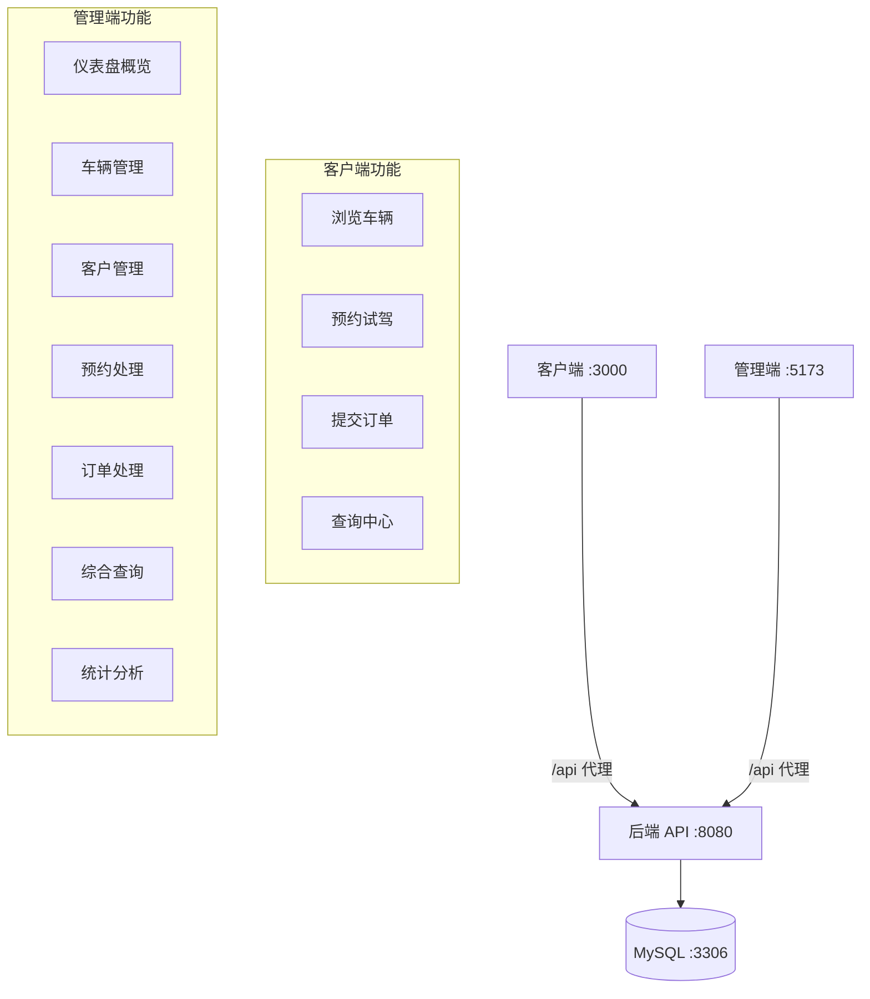

# 汽车销售管理系统

## 目录

- [项目概述](#项目概述)
- [技术栈](#技术栈)
- [系统架构](#系统架构)
- [环境要求](#环境要求)
- [快速启动（一键脚本）](#快速启动一键脚本)
- [手动启动（分步）](#手动启动分步)
- [系统功能](#系统功能)
- [演示流程](#演示流程)
- [管理端功能](#管理端功能)
- [项目结构](#项目结构)
- [数据库](#数据库)
- [API 接口一览](#api-接口一览)
- [常见问题](#常见问题)

---

## 项目概述

前后端分离的汽车销售管理系统，包含**客户端**（面向购车用户）和**管理端**（面向4S店管理员）。客户无需登录，通过姓名+电话自动识别身份；管理员可以管理车辆、处理预约/订单、查看统计报表。

---

## 技术栈

| 层 | 技术 | 说明 |
|---|------|------|
| **前端（客户端）** | Vue 3 + Vite | 端口 3000 |
| **前端（管理端）** | Vue 3 + Vite + ECharts | 端口 5173 |
| **后端** | Spring Boot 3 + JPA | 端口 8080 |
| **数据库** | MySQL 8 + 触发器 | 端口 3306 |
| **构建工具** | Maven Wrapper | 自动下载 Maven |

---

## 系统架构



---

## 环境要求

| 依赖 | 版本要求 | 说明 |
|------|---------|------|
| JDK | ≥ 17 | 当前使用 JDK 25 |
| Node.js | ≥ 18 | 前端构建需要 |
| MySQL | 8.x | 数据库 |
| Maven | 3.9+ | 使用内置 wrapper 自动处理 |

---

## 快速启动（一键脚本）

在项目根目录执行：

```powershell
# Windows PowerShell
.\start-all.ps1
```

等待约 **25 秒**后访问：

| 地址 | 说明 |
|------|------|
| http://localhost:3000 | **客户端** — 用户端 |
| http://localhost:5173 | **管理端** — 管理员端 |
| http://localhost:8080 | 后端 API |

停止服务：

```powershell
.\stop-all.ps1
```

查看运行状态：

```powershell
.\status.ps1
```

> 启动脚本会自动执行：检查 MySQL → 编译后端 → 启动后端 → 启动客户端 → 启动管理端 → 验证 API

---

## 手动启动（分步）

### 1. 确保 MySQL 运行

```powershell
net start MySQL80
```

或用 MySQL 命令行检查：

```powershell
mysql -u root -p123456 -e "SELECT 1"
```

### 2. 启动后端

```powershell
cd code\car-sales-backend
.\mvnw.cmd clean package -DskipTests
java -jar target\car-sales-backend-1.0.0.jar
```

后端启动时会自动执行 `schema.sql`（建表）和 `data.sql`（种子数据）。

### 3. 启动客户端

```powershell
cd code\car-sales-client
npm install
npm run dev
```

访问 http://localhost:3000

### 4. 启动管理端

```powershell
cd code\car-sales-admin
npm install
npm run dev
```

访问 http://localhost:5173

---

## 系统功能

### 客户端（用户端）

| 功能 | 路径 | 说明 |
|------|------|------|
| 🚗 **在售车辆** | `/` | 浏览所有在售车辆列表 |
| 📄 **车辆详情** | `/cars/:id` | 查看车辆详细参数与价格 |
| 📅 **提交预约** | `/appointment/new` | 填写预约试驾（姓名+电话+车辆+时间） |
| 📋 **我的预约** | `/my/appointments` | 按编号查询预约状态 |
| 🛒 **提交订单** | `/orders/new` | 下单购车（姓名+电话+车辆+数量） |
| 📦 **我的订单** | `/my/orders` | 按编号查询订单状态 |
| 🔍 **查询中心** | `/query` | 统一查询入口 |

### 管理端（管理员端）

| 功能 | 路径 | 说明 |
|------|------|------|
| 📊 **仪表盘** | `/admin` | 系统概览（车辆/客户/待处理数量） |
| 🚙 **车辆管理** | `/admin/cars` | 新增/编辑/删除/导入车辆 |
| 👤 **客户管理** | `/admin/users` | 查看客户列表，按姓名/电话搜索 |
| 📅 **预约管理** | `/admin/appointments` | 确认/取消预约申请 |
| 📋 **订单管理** | `/admin/orders` | 确认/取消订单（确认后自动扣库存） |
| 🔍 **综合查询** | `/admin/queries` | 按车型/价格/客户/日期筛选订单 |
| 📈 **统计分析** | `/admin/statistics` | 销量排行/价格区间/销售额占比图表 |

---

## 演示流程

### 推荐演示路径

```
1. 打开客户端 http://localhost:3000
   → 看到在售车辆列表（8 辆车）

2. 点击其中一辆车
   → 进入详情页，查看完整参数

3. 在详情页点击"预约试驾"
   → 填写姓名、电话、预约时间 → 提交
   → 获得预约编号

4. 点击侧边栏"提交订单"
   → 选择同一辆车，填写姓名、电话、数量 → 提交
   → 获得订单编号

5. 打开管理端 http://localhost:5173
   → 仪表盘显示统计数据（车辆总数、客户数等）

6. 点击"预约管理"
   → 看到待确认的预约 → 点击"确认"

7. 点击"订单管理"
   → 看到待确认的订单 → 点击"确认"
   → 库存自动扣减

8. 点击"统计分析"
   → 查看销量排行柱状图、价格区间饼图
```

---

## 项目结构

```
car-sales-management/
├── code/
│   ├── car-sales-backend/        # Spring Boot 后端
│   │   ├── src/main/java/com/carsales/
│   │   │   ├── controller/       # REST 控制器
│   │   │   ├── service/          # 业务逻辑
│   │   │   ├── repository/       # JPA 数据访问
│   │   │   ├── entity/           # 实体类
│   │   │   └── dto/              # 数据传输对象
│   │   └── src/main/resources/
│   │       ├── schema.sql        # 数据库建表脚本
│   │       ├── data.sql          # 初始测试数据
│   │       └── application.yml   # 配置文件
│   ├── car-sales-client/         # Vue 3 客户端
│   │   └── src/views/            # 页面组件
│   ├── car-sales-admin/          # Vue 3 管理端
│   │   └── src/views/            # 页面组件
│   └── qa-tests/                 # E2E 自动化测试
│       └── test-all.mjs          # 全功能测试脚本
├── design/                       # 课程设计文档
│   ├── car-sales-management-requirements.md
│   ├── car-sales-management-hld.md
│   ├── car-sales-management-lld.md
│   ├── car-sales-management-product-backlog.md
│   └── car-sales-management-db-design.md
├── plan/                         # 敏捷交付文档
├── quality/                      # 质量文档
├── start-all.ps1                 # 一键启动脚本
├── stop-all.ps1                  # 一键停止脚本
├── status.ps1                    # 状态查看脚本
└── README.md                     # 本文件
```

---

## 数据库

### 表结构

| 表名 | 说明 | 核心字段 |
|------|------|---------|
| `customer` | 客户表 | customer_id, real_name, phone |
| `car` | 车辆表 | car_id, brand, model, price, stock, status |
| `appointment` | 预约表 | appointment_id, customer_id, car_id, status |
| `order` | 订单表 | order_id, customer_id, car_id, quantity, status |

### 触发器

| 触发器 | 触发时机 | 行为 |
|--------|---------|------|
| `trg_order_confirm_deduct_stock` | 订单确认后 | 自动扣减车辆库存 |
| `trg_order_cancel_restore_stock` | 订单取消后 | 自动恢复车辆库存 |
| `trg_car_stock_check_update_status` | 库存更新前 | 库存为 0 时自动设为停售 |

### 连接信息

| 参数 | 值 |
|------|-----|
| 主机 | `localhost:3306` |
| 数据库 | `car_sales_db` |
| 用户名 | `root` |
| 密码 | `123456` |

> **⚠️ 如果 MySQL 密码不同**，克隆项目后请修改  
> `code/car-sales-backend/src/main/resources/application.yml` 第 8 行：
> ```yaml
> password: 你的MySQL密码
> ```
> 修改后重新编译启动即可。

### 种子数据

启动时自动初始化：
- **3 条客户**：张三、李四、王五
- **8 辆车**：丰田 RAV4、本田 CR-V、大众途观L、宝马 3系、丰田凯美瑞、特斯拉 Model Y、比亚迪汉EV、保时捷718
- **5 条预约**：部分已确认
- **5 条订单**：部分已确认（确认的订单会自动扣减库存）

---

## API 接口一览

| 方法 | 路径 | 说明 |
|------|------|------|
| GET | `/api/cars` | 车辆列表（支持品牌/型号/价格筛选） |
| GET | `/api/cars/{id}` | 车辆详情 |
| POST | `/api/cars` | 新增车辆 |
| PUT | `/api/cars/{id}` | 编辑车辆 |
| DELETE | `/api/cars/{id}` | 删除车辆 |
| POST | `/api/cars/import` | Excel 批量导入 |
| GET | `/api/cars/template` | 下载导入模板 |
| GET | `/api/customers` | 客户列表（支持 keyword 搜索） |
| GET | `/api/appointments` | 预约列表 |
| GET | `/api/appointments/{id}` | 预约详情 |
| POST | `/api/appointments` | 创建预约 |
| PUT | `/api/appointments/{id}/confirm` | 确认预约 |
| PUT | `/api/appointments/{id}/reject` | 取消预约 |
| GET | `/api/purchase-orders` | 订单列表 |
| GET | `/api/purchase-orders/{id}` | 订单详情 |
| POST | `/api/purchase-orders` | 创建订单 |
| PUT | `/api/purchase-orders/{id}/confirm` | 确认订单 |
| PUT | `/api/purchase-orders/{id}/cancel` | 取消订单 |
| GET | `/api/statistics/sales-hot` | 销量排行 |
| GET | `/api/statistics/sales-share` | 销售额占比 |
| GET | `/api/statistics/price-range` | 价格区间统计 |
| GET | `/api/queries/sales` | 综合查询 |

---

## 常见问题

### Q: MySQL 启动失败

```powershell
# 检查 MySQL 服务状态
net start MySQL80

# 如果提示服务名无效
# 先找到实际的服务名：
Get-Service *mysql*

```

### Q: 端口被占用

```powershell
# 查看占用 8080 端口的进程
Get-NetTCPConnection -LocalPort 8080

# 强制终止
Stop-Process -Id <PID> -Force
```

### Q: 后端启动报错 `Port 8080 already in use`

先停止已有的后端进程再启动：

```powershell
.\stop-all.ps1
.\start-all.ps1
```

### Q: 前端页面空白或无法访问

确认 Vite 代理配置正确（`vite.config.js` 中 `/api` 指向 `localhost:8080`）。

### Q: 数据库表结构变更后如何重置？

删除数据库后重启后端即可自动重建：

```sql
DROP DATABASE IF EXISTS car_sales_db;
CREATE DATABASE car_sales_db;
```

### Q: 统计分析图表不显示？

确认有已确认的订单（`status = 'confirmed'`）。在管理端"订单管理"中确认几个订单后，统计数据会自动生成。

---

## 运行测试

```powershell
cd code\qa-tests
npm install
node test-all.mjs
```

测试覆盖：API 接口 10 项 + 客户端功能 8 项 + 管理端功能 10 项 = **39 项测试**。

