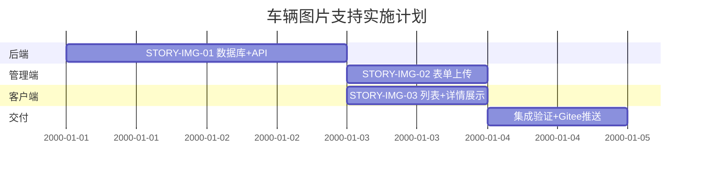

# 车辆图片支持 — 批准的设计包

## Initiative
在售车辆图片展示功能增强

## Decision Summary

| 决策 | 选项 | 依据 |
|------|------|------|
| 图片存储 | 本地文件系统 (`uploads/images/`) | 零外部依赖，适合单机部署 |
| API 签名 | 一步 multipart/form-data | 原子提交，用户体验好 |
| 图片约束 | 单图选填，≤5MB，jpg/png/webp | 最小侵入，不影响现有流程 |

## Architecture Decision Records
- `workspace/car-sales-management/design/car-image-support-architecture-decisions.md`

## Scope Baseline
**In Scope:**
- `car` 表新增 `image_url` 列
- 后端图片上传/替换/移除 API
- 管理端新增/编辑表单图片上传
- 客户端列表和详情页真实图片展示
- Gitee 推送

**Out of Scope:**
- 多图支持
- 图片裁剪/压缩/水印
- CDN / 对象存储
- 定时清理脚本

## Architecture Constraints
1. 图片选填，无 `image_url` 的车在全链路正常运行
2. 后端 API `POST` / `PUT /api/cars` 从 JSON 改为 multipart/form-data
3. 图片路径 `uploads/images/{carId}.{ext}`，URL 通过静态资源映射直接访问
4. 编辑时不传图片文件视为保留原图

## HLD References
- `workspace/car-sales-management/design/car-image-support-enhancement-design.md`
- 采用架构：`单页面文件上传 → Controller → Service → 本地文件系统 + DB`

## LLD References

### 后端变更清单

| 文件 | 变更 |
|------|------|
| `schema.sql` | `ALTER TABLE car ADD COLUMN image_url VARCHAR(500) DEFAULT NULL` |
| `Car.java` | 新增 `private String imageUrl` |
| `CarController.java` | `create()`/`update()` 改为 `@RequestParam` + `@RequestPart("image", required=false) MultipartFile` |
| `CarService.java` | 新增 `saveImage()`, `deleteImage()`, `buildImageUrl()` 方法 |
| `application.yml` | 新增 `spring.servlet.multipart.*` + `spring.web.resources.static-locations` |
| `uploads/images/` | 新目录 + `.gitkeep` |

### 管理端前端变更清单

| 文件 | 变更 |
|------|------|
| `CarForm.vue` | 新增 `<input type="file">` + 图片预览 + 移除按钮；提交改为 `FormData` |
| `api/index.js` | `createCar()`/`updateCar()` 改为接收 FormData |

### 客户端前端变更清单

| 文件 | 变更 |
|------|------|
| `CarList.vue` | `🚗` → `` + `@error` 回退默认占位 |
| `CarDetail.vue` | 同上 |
| `main.css` | `.card-image`/`.detail-image` `background` → `object-fit: cover` + `` 样式 |

## Product Backlog References
- `workspace/car-sales-management/design/car-image-support-product-backlog.md`

## Milestone Mapping

| Milestone | Sprint | Stories | Points | Status |
|-----------|--------|---------|:------:|:------:|
| MS-IMG-01 | Sprint-1 | STORY-IMG-01, STORY-IMG-02, STORY-IMG-03 | 6 | ✅ 设计完成，待实施 |



## Traceability

```
需求（放真实车辆图片）
  └─→ Enhancement Design（影响分析 + 方案）
        ├─→ ADR-001（本地文件存储）
        ├─→ ADR-002（一步 multipart 提交）
        ├─→ ADR-003（单图选填 5MB）
        └─→ Product Backlog（3 个 Story）
              └─→ Milestone MS-IMG-01（6 点，1 Sprint）
```

## Open Risks
- 无

## Change Request History
| CR ID | Description | Status |
|-------|-------------|:------:|
| — | — | — |

## Approval Record

| Role | Decision | Date |
|------|----------|:----:|
| architect-plan | ✅ **APPROVED** | 2026-07-11 |
