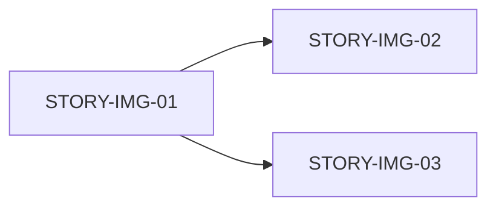

# 车辆图片支持 — 里程碑计划

## Initiative
车辆图片展示功能增强

## Overview

| Milestone | Name | Scope | Points | Status |
|-----------|------|-------|:------:|:------:|
| MS-IMG-01 | 车辆图片全链路支持 | STORY-IMG-01, STORY-IMG-02, STORY-IMG-03 | 6 | 设计中 |

## Dependency Graph



## Per-Milestone Detail

### MS-IMG-01: 车辆图片全链路支持

#### Goal
实现从数据库 → 后端 API → 管理端上传 → 客户端展示的完整图片链路，所有车辆可附带一张真实图片。

#### Scope

| Type | Content | Priority |
|------|---------|:--------:|
| DB | `car` 表新增 `image_url` 列 | High |
| Backend | 图片上传/替换/移除 API | High |
| Admin | 车辆新增/编辑表单图片上传 | High |
| Client | 车辆列表/详情页图片展示 | High |

#### Stories

| Story | Title | Points | Key Deliverables |
|-------|-------|:------:|------------------|
| STORY-IMG-01 | 后端：图片列 + 上传接口 | 3 | schema.sql 变更、Car.java 实体、CarController 改造、CarService 图片处理、application.yml 配置、uploads/ 目录 |
| STORY-IMG-02 | 管理端：表单图片上传 | 2 | CarForm.vue 改造、api/index.js 适配 |
| STORY-IMG-03 | 客户端：真实图片展示 | 1 | CarList.vue、CarDetail.vue、main.css 更新 |

#### Delivery Checklist

- [ ] `schema.sql` — `image_url` 列 DDL
- [ ] `Car.java` — `imageUrl` 字段
- [ ] `CarController.java` — multipart 接收
- [ ] `CarService.java` — 图片文件操作
- [ ] `application.yml` — multipart + static-resources
- [ ] `uploads/images/` — 目录 + .gitkeep
- [ ] `CarForm.vue` — 图片上传 + 预览
- [ ] `api/index.js` (admin) — FormData 适配
- [ ] `CarList.vue` — 真实图片
- [ ] `CarDetail.vue` — 真实图片
- [ ] `main.css` — 图片样式
- [ ] Gitee 推送

## Key Principles

### Implementation Order
```
STORY-IMG-01 (后端) → STORY-IMG-02 (管理端) + STORY-IMG-03 (客户端) 可并行
```

### Non-breaking Rule
- 图片为选填，无 `image_url` 的车辆在全链路中正常运行
- 客户端 API（只读）接口和返回结构不变，仅新增字段

### Out of Scope
- 多图支持（仅单图）
- 图片裁剪/压缩/水印
- CDN 加速
- 图片定时清理
