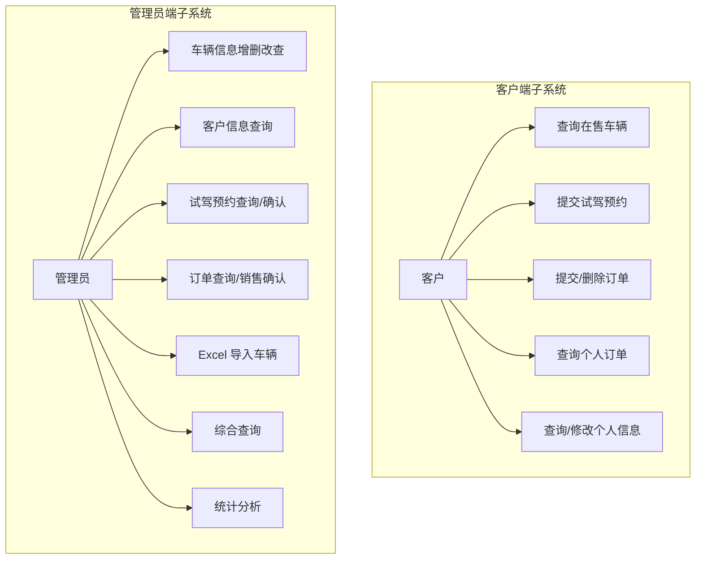
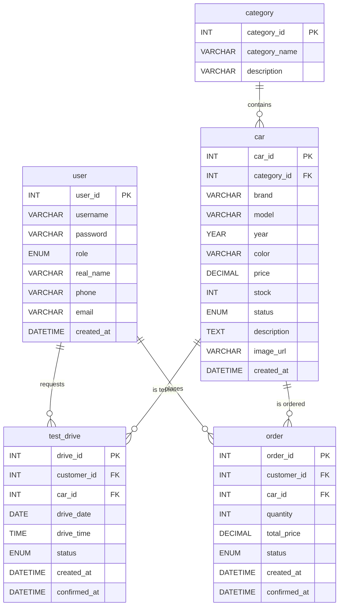
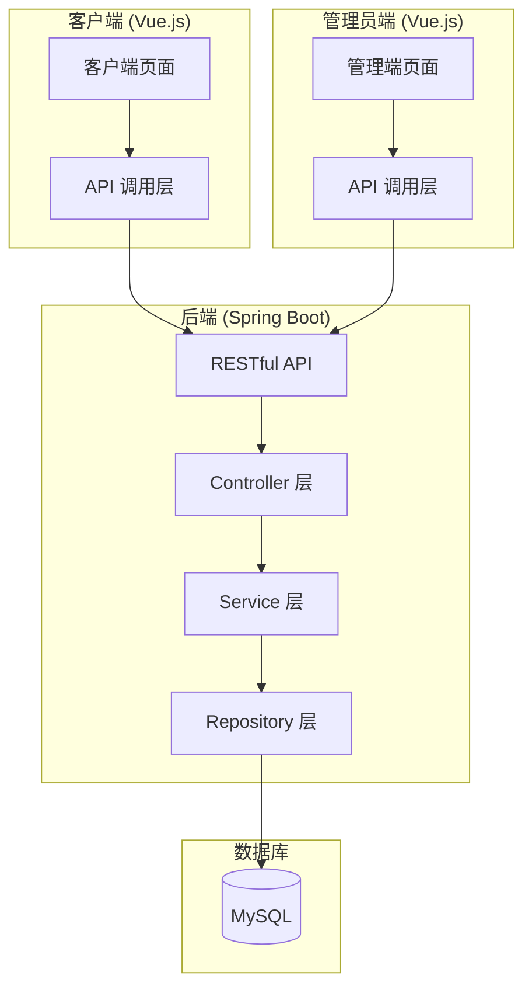
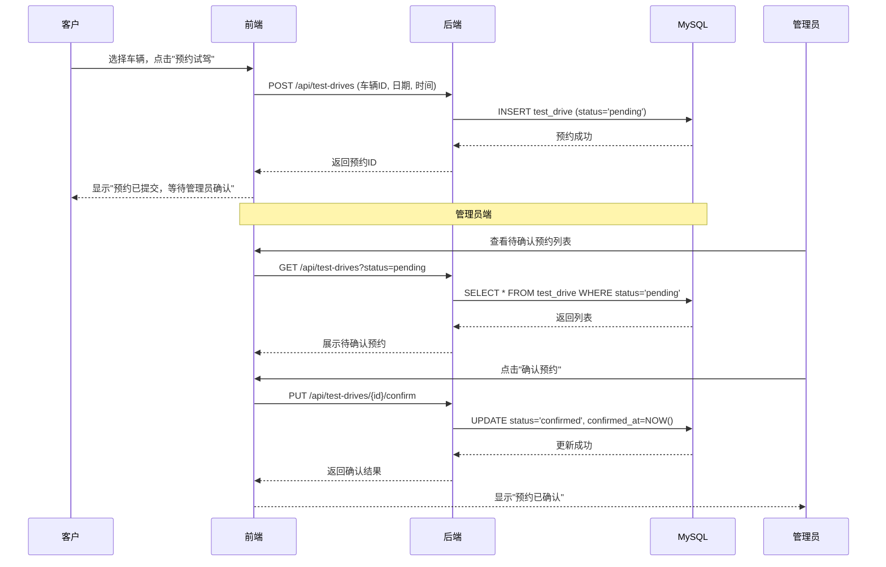
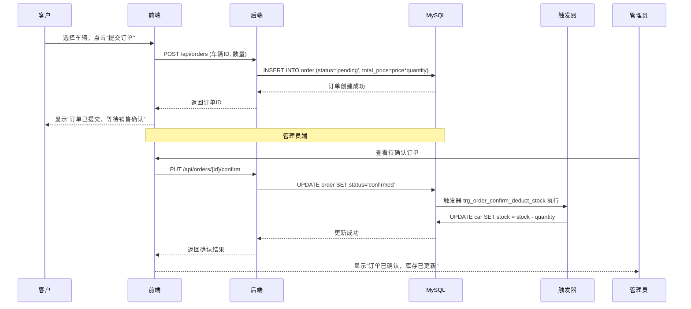
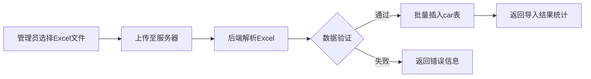

# 汽车销售管理系统 - 小组设计文档

---

## 封面

**西安建筑科技大学**  
**课程设计（论文）报告**

**题目：** 汽车销售管理系统  
**专业班级：** ____________  
**小组成员：** 姚奕旸（组长）、禹海超、魏熇  
**指导教师：** ____________  
**日期：** ____________

---

# 第一部分：系统需求分析

## 1.1 项目背景

本系统为"汽车销售管理信息系统"课程设计项目。随着汽车销售行业的快速发展，传统的手工管理方式已无法满足企业对销售数据、客户信息、试驾预约和订单管理的需求。本系统旨在通过计算机信息化手段，实现对汽车销售全流程的数字化管理。

## 1.2 角色定义

| 角色 | 权限范围 | 说明 |
|------|---------|------|
| **客户** | 查询和修改自己的基本信息、查询在售车辆、提交试驾预约、提交/删除购车订单、查询自己订单 | 无管理权限 |
| **管理员** | 全部系统功能 | 车辆信息维护、客户查询、试驾预约确认、订单确认、数据导入、综合查询、统计分析 |

## 1.3 功能需求

系统共分为 **5 大功能模块**：

### 模块一：用户管理
- 系统用户分为"客户"和"管理员"两类
- 客户可查询和修改自己的基本信息
- 管理员可使用系统的全部功能

### 模块二：试驾销售管理
**管理员功能：**
- 在售汽车基本信息查询
- 在售汽车信息维护（增、删、改）
- 客户信息查询
- 试驾预约查询
- 试驾预约确认
- 购车订单查询
- 购车订单销售确认

**客户功能：**
- 在售汽车基本信息查询
- 提交试驾预约
- 提交/删除购车订单
- 查询自己的订单

### 模块三：数据导入
- 管理员对在售汽车信息进行 Excel 批量导入
- 支持标准格式的 Excel 文件上传解析

### 模块四：综合查询
- 管理员对全体客户、试驾预约信息、订单、销售情况进行综合查询
- 支持按汽车类型、销售额、客户信息、销售时间等条件进行精确查询和模糊查询

### 模块五：统计分析
- 试驾情况统计分析（试驾热点车型排行）
- 汽车销售情况统计分析（销量热点车型排行）
- 以图表形式展示统计结果

## 1.4 用例分析



## 1.5 非功能性需求

| 需求类别 | 要求 |
|---------|------|
| 界面要求 | 采用可视化图形界面，操作直观 |
| 数据库要求 | 满足 3NF，设计主-从关系和外键约束 |
| 数据库管理系统 | MySQL |
| 开发平台 | Java (Spring Boot) + Vue.js |
| 响应时间 | 常规操作响应时间 ≤ 3 秒 |

---

# 第二部分：数据库概要及物理结构设计

## 2.1 实体与属性分析

### 实体 1：用户 (user)

| 属性 | 类型 | 说明 |
|------|------|------|
| user_id | INT | 用户ID（主键） |
| username | VARCHAR(50) | 用户名 |
| password | VARCHAR(100) | 密码 |
| role | ENUM('customer','admin') | 角色：客户/管理员 |
| real_name | VARCHAR(50) | 真实姓名 |
| phone | VARCHAR(20) | 联系电话 |
| email | VARCHAR(100) | 电子邮箱 |
| created_at | DATETIME | 注册时间 |

### 实体 2：车型分类 (category)

| 属性 | 类型 | 说明 |
|------|------|------|
| category_id | INT | 分类ID（主键） |
| category_name | VARCHAR(50) | 分类名称（如SUV、轿车等） |
| description | VARCHAR(200) | 分类描述 |

### 实体 3：在售车辆 (car)

| 属性 | 类型 | 说明 |
|------|------|------|
| car_id | INT | 车辆ID（主键） |
| category_id | INT | 分类ID（外键→category） |
| brand | VARCHAR(50) | 品牌 |
| model | VARCHAR(100) | 车型名称 |
| year | YEAR | 出厂年份 |
| color | VARCHAR(30) | 颜色 |
| price | DECIMAL(10,2) | 售价 |
| stock | INT | 库存数量 |
| status | ENUM('on_sale','sold_out') | 销售状态 |
| description | TEXT | 车辆描述 |
| image_url | VARCHAR(200) | 图片路径 |
| created_at | DATETIME | 录入时间 |

### 实体 4：试驾预约 (test_drive)

| 属性 | 类型 | 说明 |
|------|------|------|
| drive_id | INT | 预约ID（主键） |
| customer_id | INT | 客户ID（外键→user） |
| car_id | INT | 车辆ID（外键→car） |
| drive_date | DATE | 预约试驾日期 |
| drive_time | TIME | 预约试驾时间 |
| status | ENUM('pending','confirmed','cancelled') | 状态：待确认/已确认/已取消 |
| created_at | DATETIME | 申请时间 |
| confirmed_at | DATETIME | 确认时间 |

### 实体 5：购车订单 (`order`)

| 属性 | 类型 | 说明 |
|------|------|------|
| order_id | INT | 订单ID（主键） |
| customer_id | INT | 客户ID（外键→user） |
| car_id | INT | 车辆ID（外键→car） |
| quantity | INT | 购买数量 |
| total_price | DECIMAL(10,2) | 总价 |
| status | ENUM('pending','confirmed','cancelled') | 状态：待确认/已确认/已取消 |
| created_at | DATETIME | 下单时间 |
| confirmed_at | DATETIME | 确认时间 |

## 2.2 E-R 图



## 2.3 关系表转换与 3NF 验证

### 规范化过程

| 步骤 | 说明 |
|------|------|
| 1NF | 所有属性均为原子值，无重复组 ✅ |
| 2NF | 所有非主属性完全依赖于主键，消除部分依赖 ✅ |
| 3NF | 所有非主属性直接依赖于主键，无传递依赖 ✅ |

### 3NF 验证结果

| 表 | 主键 | 是否有部分依赖 | 是否有传递依赖 | 判定 |
|----|------|:-------------:|:-------------:|:----:|
| user | user_id | 无 | 无 | ✅ 3NF |
| category | category_id | 无 | 无 | ✅ 3NF |
| car | car_id | 无 | 无 | ✅ 3NF |
| test_drive | drive_id | 无 | 无 | ✅ 3NF |
| `order` | order_id | 无 | 无 | ✅ 3NF |

## 2.4 表结构详细定义

### user 表

| 字段名 | 类型 | 约束 | 说明 |
|--------|------|------|------|
| user_id | INT | PRIMARY KEY, AUTO_INCREMENT | 用户ID |
| username | VARCHAR(50) | NOT NULL, UNIQUE | 用户名 |
| password | VARCHAR(100) | NOT NULL | 密码 |
| role | ENUM('customer','admin') | NOT NULL, DEFAULT 'customer' | 角色 |
| real_name | VARCHAR(50) |  | 真实姓名 |
| phone | VARCHAR(20) |  | 联系电话 |
| email | VARCHAR(100) |  | 邮箱 |
| created_at | DATETIME | NOT NULL, DEFAULT CURRENT_TIMESTAMP | 创建时间 |

### category 表

| 字段名 | 类型 | 约束 | 说明 |
|--------|------|------|------|
| category_id | INT | PRIMARY KEY, AUTO_INCREMENT | 分类ID |
| category_name | VARCHAR(50) | NOT NULL, UNIQUE | 分类名称 |
| description | VARCHAR(200) |  | 描述 |

### car 表

| 字段名 | 类型 | 约束 | 说明 |
|--------|------|------|------|
| car_id | INT | PRIMARY KEY, AUTO_INCREMENT | 车辆ID |
| category_id | INT | NOT NULL, FOREIGN KEY → category(category_id) | 分类ID |
| brand | VARCHAR(50) | NOT NULL | 品牌 |
| model | VARCHAR(100) | NOT NULL | 车型 |
| year | YEAR |  | 出厂年份 |
| color | VARCHAR(30) |  | 颜色 |
| price | DECIMAL(10,2) | NOT NULL | 售价 |
| stock | INT | NOT NULL, DEFAULT 0 | 库存 |
| status | ENUM('on_sale','sold_out') | NOT NULL, DEFAULT 'on_sale' | 状态 |
| description | TEXT |  | 描述 |
| image_url | VARCHAR(200) |  | 图片 |
| created_at | DATETIME | NOT NULL, DEFAULT CURRENT_TIMESTAMP | 录入时间 |

### test_drive 表

| 字段名 | 类型 | 约束 | 说明 |
|--------|------|------|------|
| drive_id | INT | PRIMARY KEY, AUTO_INCREMENT | 预约ID |
| customer_id | INT | NOT NULL, FOREIGN KEY → user(user_id) | 客户ID |
| car_id | INT | NOT NULL, FOREIGN KEY → car(car_id) | 车辆ID |
| drive_date | DATE | NOT NULL | 预约日期 |
| drive_time | TIME | NOT NULL | 预约时间 |
| status | ENUM('pending','confirmed','cancelled') | NOT NULL, DEFAULT 'pending' | 状态 |
| created_at | DATETIME | NOT NULL, DEFAULT CURRENT_TIMESTAMP | 申请时间 |
| confirmed_at | DATETIME |  | 确认时间 |

### `order` 表

| 字段名 | 类型 | 约束 | 说明 |
|--------|------|------|------|
| order_id | INT | PRIMARY KEY, AUTO_INCREMENT | 订单ID |
| customer_id | INT | NOT NULL, FOREIGN KEY → user(user_id) | 客户ID |
| car_id | INT | NOT NULL, FOREIGN KEY → car(car_id) | 车辆ID |
| quantity | INT | NOT NULL, DEFAULT 1 | 数量 |
| total_price | DECIMAL(10,2) | NOT NULL | 总价 |
| status | ENUM('pending','confirmed','cancelled') | NOT NULL, DEFAULT 'pending' | 状态 |
| created_at | DATETIME | NOT NULL, DEFAULT CURRENT_TIMESTAMP | 下单时间 |
| confirmed_at | DATETIME |  | 确认时间 |

## 2.5 主-从关系说明

| 主表 | 从表 | 外键字段 | 关系类型 |
|------|------|---------|---------|
| category | car | category_id | 一对多：一个分类下有多辆车 |
| user | test_drive | customer_id | 一对多：一个客户可多次试驾预约 |
| car | test_drive | car_id | 一对多：一辆车被多次预约 |
| user | `order` | customer_id | 一对多：一个客户可下多个订单 |
| car | `order` | car_id | 一对多：一辆车被多次订购 |

## 2.6 触发器设计

### 触发器一：订单确认后自动扣减库存

```sql
-- 当订单状态改为 'confirmed' 时，自动扣减对应车辆的库存
CREATE TRIGGER trg_order_confirm_deduct_stock
AFTER UPDATE ON `order`
FOR EACH ROW
BEGIN
    IF NEW.status = 'confirmed' AND OLD.status = 'pending' THEN
        UPDATE car 
        SET stock = stock - NEW.quantity 
        WHERE car_id = NEW.car_id;
    END IF;
END;
```

**触发事件：** 订单状态从 pending 更新为 confirmed  
**处理逻辑：** 对应车辆的库存减去订单中的购买数量  
**关联对象：** `order` 表（主）→ car 表（从）

### 触发器二：订单取消后自动恢复库存

```sql
-- 当订单状态改为 'cancelled' 且之前为 'confirmed' 时，恢复库存
CREATE TRIGGER trg_order_cancel_restore_stock
AFTER UPDATE ON `order`
FOR EACH ROW
BEGIN
    IF NEW.status = 'cancelled' AND OLD.status = 'confirmed' THEN
        UPDATE car 
        SET stock = stock + NEW.quantity 
        WHERE car_id = NEW.car_id;
    END IF;
END;
```

**触发事件：** 订单状态从 confirmed 更新为 cancelled  
**处理逻辑：** 对应车辆的库存加上之前扣减的数量  
**关联对象：** `order` 表（主）→ car 表（从）

### 触发器三：库存归零后自动更新车辆状态

```sql
-- 当车辆库存变为 0 时，自动将销售状态改为 'sold_out'
CREATE TRIGGER trg_car_stock_check_update_status
AFTER UPDATE ON car
FOR EACH ROW
BEGIN
    IF NEW.stock <= 0 AND OLD.stock > 0 THEN
        UPDATE car 
        SET status = 'sold_out' 
        WHERE car_id = NEW.car_id;
    END IF;
END;
```

**触发事件：** car 表的 stock 字段更新  
**处理逻辑：** 库存 ≤ 0 时自动将销售状态更新为"已售罄"  
**关联对象：** car 表自身

---

# 第三部分：系统详细设计

## 3.1 系统架构图



## 3.2 后端 API 接口设计

### 用户管理接口

| 方法 | URL | 说明 | 角色 |
|------|-----|------|------|
| GET | /api/users/{id} | 查询用户信息 | 客户/管理员 |
| PUT | /api/users/{id} | 修改用户信息 | 客户/管理员 |
| GET | /api/users | 查询所有用户 | 管理员 |

### 车辆管理接口

| 方法 | URL | 说明 | 角色 |
|------|-----|------|------|
| GET | /api/cars | 查询在售车辆列表 | 客户/管理员 |
| GET | /api/cars/{id} | 查询车辆详情 | 客户/管理员 |
| POST | /api/cars | 新增车辆 | 管理员 |
| PUT | /api/cars/{id} | 修改车辆信息 | 管理员 |
| DELETE | /api/cars/{id} | 删除车辆 | 管理员 |
| POST | /api/cars/import | Excel 批量导入车辆 | 管理员 |

### 试驾预约接口

| 方法 | URL | 说明 | 角色 |
|------|-----|------|------|
| GET | /api/test-drives | 查询试驾预约列表 | 管理员（全部）/客户（自己） |
| POST | /api/test-drives | 提交试驾预约 | 客户 |
| PUT | /api/test-drives/{id}/confirm | 确认试驾预约 | 管理员 |
| PUT | /api/test-drives/{id}/cancel | 取消预约 | 管理员 |

### 购车订单接口

| 方法 | URL | 说明 | 角色 |
|------|-----|------|------|
| GET | /api/orders | 查询订单列表 | 管理员（全部）/客户（自己） |
| POST | /api/orders | 提交订单 | 客户 |
| DELETE | /api/orders/{id} | 删除订单 | 客户 |
| PUT | /api/orders/{id}/confirm | 确认订单（销售确认） | 管理员 |

### 查询统计接口

| 方法 | URL | 说明 | 角色 |
|------|-----|------|------|
| GET | /api/queries/sales | 综合销售查询 | 管理员 |
| GET | /api/statistics/test-drive-hot | 试驾热点统计 | 管理员 |
| GET | /api/statistics/sales-hot | 销量热点统计 | 管理员 |

## 3.3 核心功能处理流程

### 试驾预约流程



### 购车订单确认流程



### Excel 导入流程



## 3.4 前端页面结构

### 客户端页面路由

```
客户端首页 (/)
├── 在售车辆列表 (/cars)
├── 车辆详情 (/cars/:id)
├── 提交试驾预约 (/test-drive/new)
├── 我的预约 (/my/test-drives)
├── 提交订单 (/orders/new)
├── 我的订单 (/my/orders)
└── 个人信息 (/my/profile)
```

### 管理员端页面路由

```
管理端首页 (/admin)
├── 车辆管理 (/admin/cars)
│   ├── 车辆列表 (/admin/cars)
│   ├── 新增车辆 (/admin/cars/new)
│   ├── 编辑车辆 (/admin/cars/:id/edit)
│   └── Excel导入 (/admin/cars/import)
├── 客户管理 (/admin/users)
│   └── 客户列表 (/admin/users)
├── 试驾预约管理 (/admin/test-drives)
│   ├── 待确认预约 (/admin/test-drives?status=pending)
│   └── 全部预约 (/admin/test-drives)
├── 订单管理 (/admin/orders)
│   ├── 待确认订单 (/admin/orders?status=pending)
│   └── 全部订单 (/admin/orders)
├── 综合查询 (/admin/queries)
├── 统计分析 (/admin/statistics)
│   ├── 试驾热点统计
│   └── 销量热点统计
└── 管理员信息 (/admin/profile)
```

## 3.5 统计图表设计

系统使用 ECharts 库实现统计分析图表可视化：

| 图表类型 | 数据来源 | 展示内容 |
|---------|---------|---------|
| 柱状图 | 试驾预约表 | 各车型试驾预约次数排行 |
| 柱状图 | 订单表 | 各车型销量排行 |
| 饼图 | 订单表 | 各车型销售额占比分布 |
| 折线图 | 订单表 | 月度销售趋势 |

---

# 附录：小组成员分工表

| 成员 | 角色 | 分工内容 | 对应任务书要求 |
|------|------|---------|:-------------:|
| **禹海超** | 数据库设计 | E-R 图设计、3NF 验证、建库建表 SQL、主外键约束、字段约束 | ① 数据库、关系表实现 |
| **魏熇** | 后端开发 & 触发器 | 3 个触发器设计与实现、Spring Boot 全部 RESTful API、核心业务处理流程实现 | ② 触发器设计 + ③ 后端部分 |
| **姚奕旸** | 组长 & 前端开发 | 项目统筹协调、Vue 前端全部页面（客户端+管理端）、ECharts 图表、前后端联调、设计文档统稿 | ③ 子系统各功能模块设计开发 + 文档整合 |

---

*本设计文档为课程设计初步设计方案，具体实现细节在开发过程中可能适当调整。*
