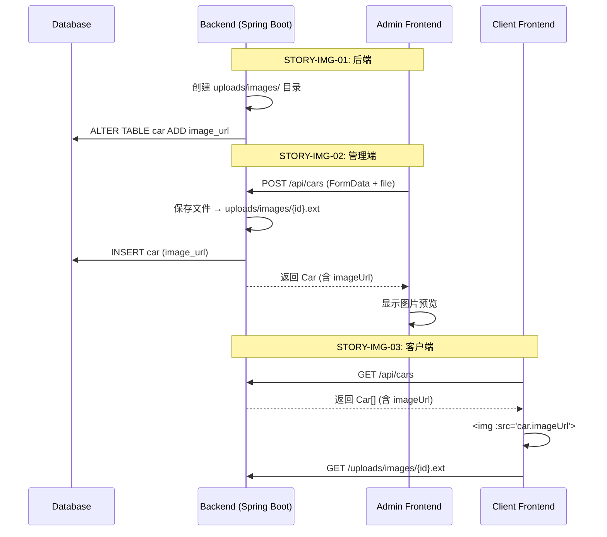

# Sprint Backlog — MS-IMG-01 / Sprint-01

## Sprint Goal
实现车辆图片完整支持链路：数据库 → 后端上传 → 管理端表单 → 客户端展示

## Sprint Backlog

| Seq | Story | Title | Owner | Points | Dependencies | Status |
|:---:|-------|-------|:-----:|:------:|:------------:|:------:|
| 1 | STORY-IMG-01 | 后端：数据库加图片列 + 文件上传接口 | backend-engineer | 3 | — | ⏳ Pending |
| 2 | STORY-IMG-02 | 管理端：表单图片上传与展示 | frontend-engineer | 2 | STORY-IMG-01 | ⏳ Pending |
| 3 | STORY-IMG-03 | 客户端：列表和详情页展示真实图片 | frontend-engineer | 1 | STORY-IMG-01 | ⏳ Pending |

**Total: 6 points**

## Task Breakdown

### STORY-IMG-01 — backend-engineer

| # | Task | Est. | Owner |
|---|------|:----:|-------|
| 1.1 | `schema.sql`: 加 `ALTER TABLE car ADD COLUMN image_url` | — | backend-engineer |
| 1.2 | `Car.java`: 加 `imageUrl` 字段 + getter/setter | — | backend-engineer |
| 1.3 | `application.yml`: 加 multipart 配置 + 静态资源映射 | — | backend-engineer |
| 1.4 | `CarService.java`: 加 `saveImage()`, `deleteImage()`, 改造 `save()`/`update()` | — | backend-engineer |
| 1.5 | `CarController.java`: 改造 `create()`/`update()` 接收 multipart | — | backend-engineer |
| 1.6 | 创建 `uploads/images/` + `.gitkeep` | — | backend-engineer |
| 1.7 | 验证：Postman/浏览器上传图片，确认可访问 | — | backend-engineer |

### STORY-IMG-02 — frontend-engineer

| # | Task | Est. | Owner |
|---|------|:----:|-------|
| 2.1 | `api/index.js`: `createCar()`/`updateCar()` 改为 FormData | — | frontend-engineer |
| 2.2 | `CarForm.vue`: 新增图片上传 input + 预览 | — | frontend-engineer |
| 2.3 | `CarForm.vue`: 编辑模式回显现有图片 | — | frontend-engineer |
| 2.4 | `CarForm.vue`: 移除图片功能 | — | frontend-engineer |
| 2.5 | 验证：新增/编辑车辆带图/不带图/换图/删图 | — | frontend-engineer |

### STORY-IMG-03 — frontend-engineer

| # | Task | Est. | Owner |
|---|------|:----:|-------|
| 3.1 | `CarList.vue`: `🚗` → `` + `@error` 回退占位 | — | frontend-engineer |
| 3.2 | `CarDetail.vue`: 同上 | — | frontend-engineer |
| 3.3 | `main.css`: `.card-image` / `.detail-image` 改为图片样式 | — | frontend-engineer |
| 3.4 | 验证：有图展示、无图占位、加载失败回退 | — | frontend-engineer |

## Sequence Diagram

## Sprint Risk Register
| Risk | Likelihood | Impact | Mitigation |
|------|:----------:|:------:|------------|
| API 签名变更导致前端请求失败 | Low | High | STORY-IMG-02 在 STORY-IMG-01 完成后紧接验证 |
| 前端 ESLint/构建错误 | Low | Medium | 各 Story 提交前 `npm run build` 验证 |
